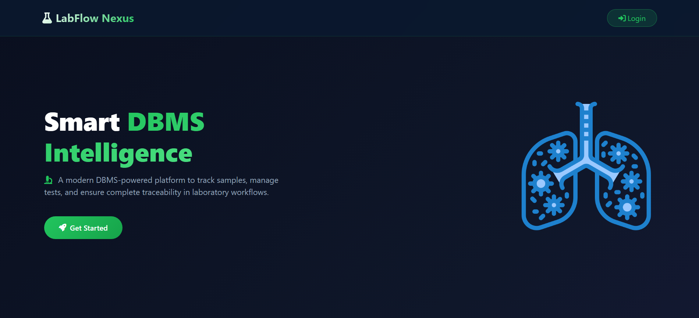
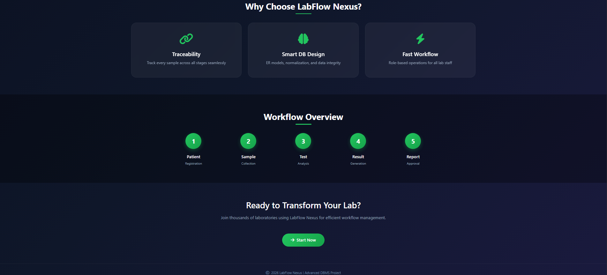
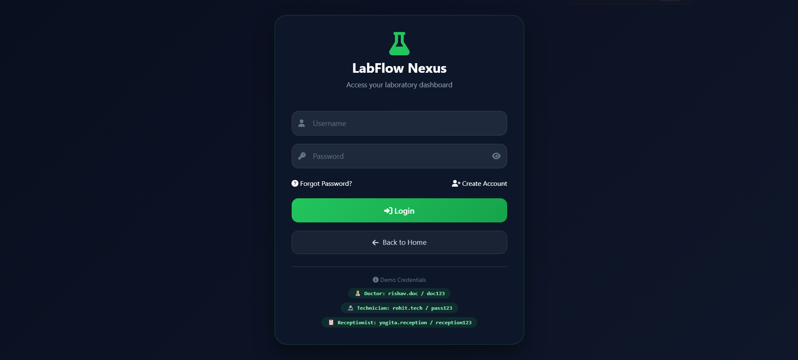
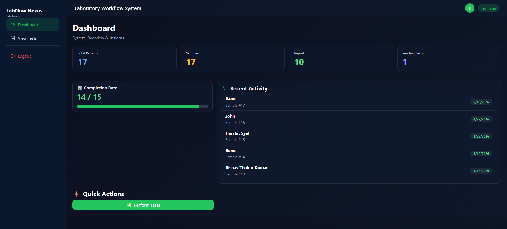
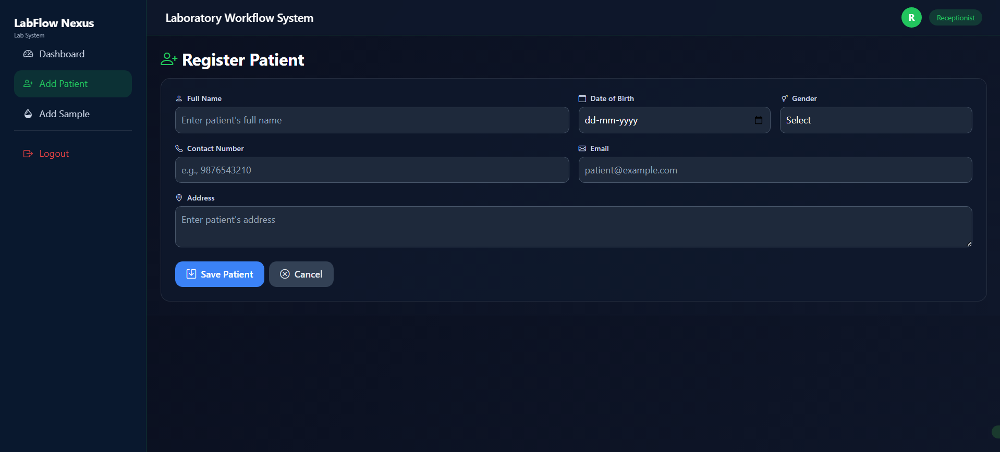
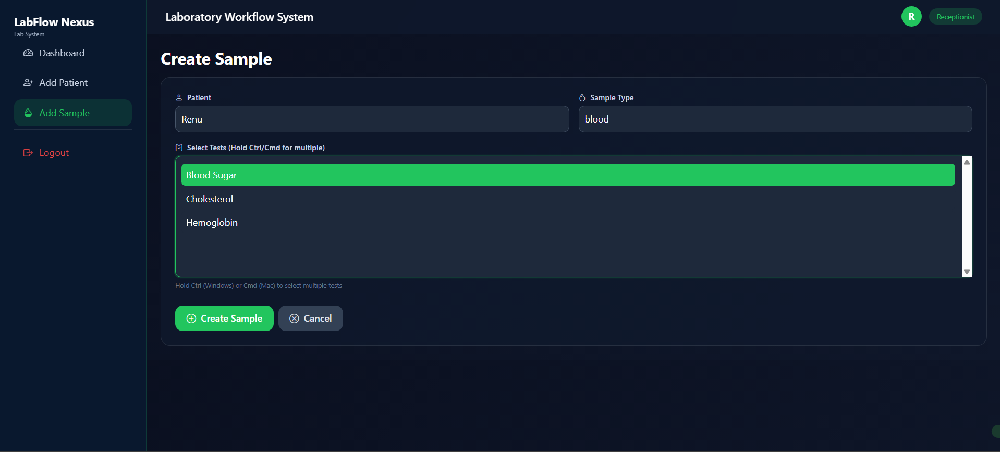
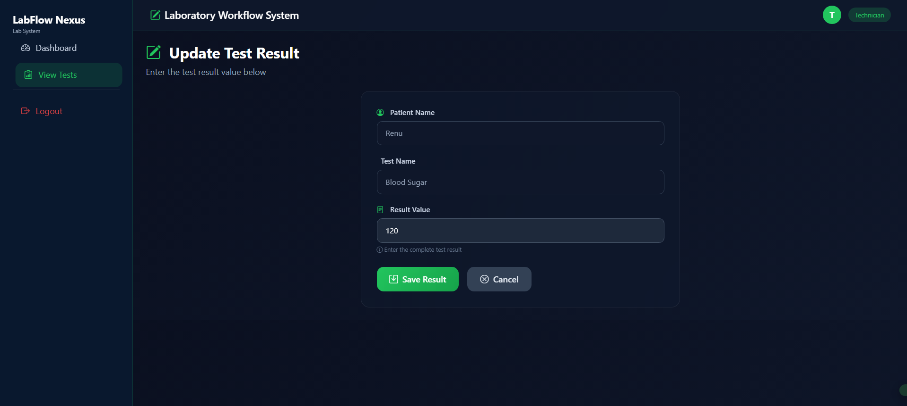
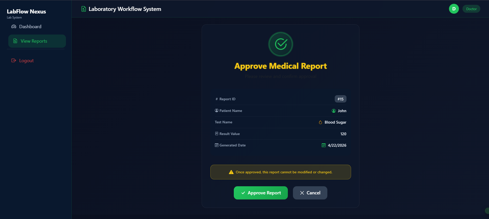

# Lab Workflow Interface

Frontend-based laboratory workflow management interface designed to simulate the workflow of diagnostic laboratory operations.

---

## Overview

This project demonstrates the basic workflow of a laboratory management system using role-based navigation and frontend page structuring.

The interface is designed to represent how different users interact with laboratory operations such as:

* patient registration,
* sample management,
* test processing,
* and report approval.

---

## Features

* Patient registration interface
* Sample tracking pages
* Test management workflow
* Report viewing and approval pages
* Role-based workflow structure
* Organized dashboard navigation

---

## Technologies Used

* HTML
* CSS
* Bootstrap
* XAMPP (Local Development Environment)

---

## User Roles

### Receptionist

* Add patient details
* Create sample entries
* Manage registration workflow

### Technician

* View assigned tests
* Update test status
* Manage sample workflow

### Doctor

* Review reports
* Approve final reports
* View patient-related information

---

## Project Structure

```text
lab-workflow/
│
├── assets/
│   ├── css/
│   ├── images/
│
├── doctor/
├── receptionist/
├── technician/
│
├── screenshots/
│
├── index.html
├── dashboard.html
├── login.html
└── README.md
```

---

## Screenshots

### Home Page

```md



```

### Login Page

```md

```

---

### Dashboard

```md

```

---

### Patient Registration

```md

```

---

### Sample Management

```md

```

---

### Technician Workflow

```md

```

---

### Doctor Report Approval

```md

```

---

## Learning Outcomes

Through this project, I practiced:

* frontend web page structuring,
* role-based workflow design,
* project organization,
* UI layout management,
* and basic healthcare workflow understanding.

---

## Future Improvements

Possible future enhancements:

* Database integration
* Authentication system
* Backend functionality
* Real-time workflow updates
* Responsive mobile optimization

---

## Author

Rishav Thakur
B.Tech Computer Engineering
SVKM’s NMIMS Chandigarh

GitHub: github.com/r1s4av
